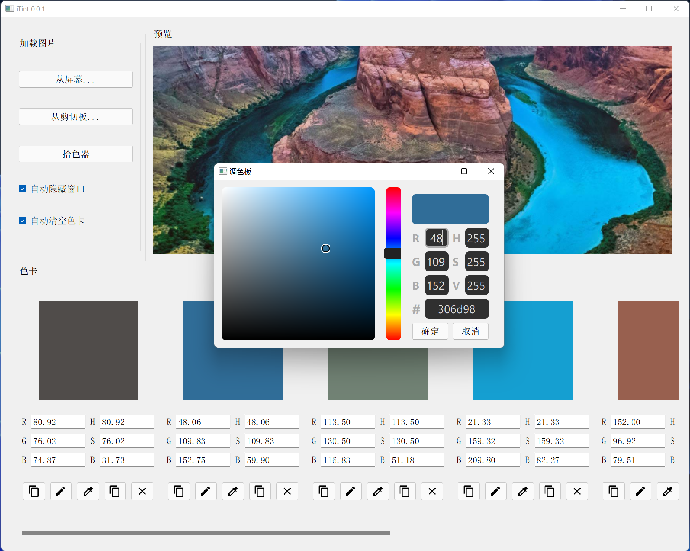

# My Projects

## 2022 H1

| Project                                                      | Keyword                   | Description                                                  | Date   |
| ------------------------------------------------------------ | ------------------------- | ------------------------------------------------------------ | ------ |
| [ColorGradingRenderer](https://github.com/ColorsWind/ColorGradingRenderer)  | LUT, OpenGL, ColorGrading | Batch color grading post-processing by offscreen rendering.  | 2022-5 |
| [Fmpeg-macOS](https://github.com/ColorsWind/FFmpeg-macOS)  | FFmpeg, macOS, python     | Scripts to build FFmpeg shared universal binaries (x86_64 and arm64) for macOS. | 2022-4 |
| [WSL-Port-Forwarding](https://github.com/ColorsWind/WSL-Port-Forwarding)   | WSL, Port Forwarding, NAT | A configuration-free, out of the box script that enables outside program access WSL2 ports by port forwarding. | 2022-3 |

## 2021 H2

| Project                                                      | Keyword                                     | Description                                                  | Date    |
| ------------------------------------------------------------ | ------------------------------------------- | ------------------------------------------------------------ | ------- |
| [Scene-OpenGL-CPP](https://github.com/ColorsWind/Scene-OpenGL-CPP)   | C++, OpenGL, GLSL                           | A dynamic scene with simple lighting and materials based on OpenGL (cpp bind). | 2021-10 |
| [Animation-LWJGL](https://github.com/ColorsWind/Animation-LWJGL)   | LWJGL, Kotlin, Game Engine                  | Simple animation rendering with an interactive edit menu by LWJGL. | 2021-11 |
| [iTinit](https://github.com/ColorsWind/iTint)   | Python, PySide2, Octree, Color Quantization | A theme color extraction and screen color picker widget.     | 2021-12 |

## 2021 H1

| Project                                                      | Keyword                           | Description                                                  | Date   |
| ------------------------------------------------------------ | --------------------------------- | ------------------------------------------------------------ | ------ |
| [SocketFileServer](https://github.com/ColorsWind/SocketFileServer)   | C++, Windows Raw Socket           | A simple file transfer client / server based on raw socket.  | 2021-6 |
| [PSO-ALS](https://github.com/ColorsWind/PSO-ALS)  | Python,  Evolutionary computation | Reproduction of the paper Particle swarm optimization with adaptive  learning strategy (and Clustering by fast search and find of density  peaks). | 2021-4 |
| [GeneticAlgorithm](https://github.com/ColorsWind/GeneticAlgorithm)  | Kotlin,  Evolutionary computation | Implementation of basic genetic algorithm in kotlin.         | 2021-4 |
| [ParticleSwarmOptimization](https://github.com/ColorsWind/ParticleSwarmOptimization)  | Kotlin,  Evolutionary computation | Implementation of basic particle swarm optimization in kotlin. | 2021-4 |
| [MovieCommentSentiment](https://github.com/ColorsWind/MovieCommentSentiment)   | Kotlin, Python, Transformer, Ktor | Chinese movie comment sentiment analysis system which contains a WEB and a python backend. | 2021-3 |
| [Pellets](https://github.com/ColorsWind/Pellets)   | C++, Qt5                          | Pellets: A classic video games written in C + +              | 2021-3 |

## 2020 H2

| Project                                                      | Keyword                     | Description                                                  | Date    |
| ------------------------------------------------------------ | --------------------------- | ------------------------------------------------------------ | ------- |
| [Sample-Compiler](https://github.com/ColorsWind/Sample-Compiler)   | Java, Compilation principle | A simple compiler that translates the Sample language to intermediate  code (Three-address instruction), which focus on parsingorsyntax  analysis. | 2020-11 |
| [ExpCalculator](https://github.com/ColorsWind/ExpCalculator)  | Java, Compilation principle | Algebraic expression calculator implemented in Java.         | 2020-7  |
| [algorimatrix](https://github.com/ColorsWind/algorimatrix)   | C++, Compilation principle, | A simple expression calculator supports matrix calculation and vectorization calculation, and implements a simple UI and basic asynchronous processing logic. It's written in C++11 with Qt5. | 2020-7  |

## 2020 H1

| Project                                                      | Keyword          | Description              | Date   |
| ------------------------------------------------------------ | ---------------- | ------------------------ | ------ |
| [SubmitManager](https://github.com/ColorsWind/SubmitManager)  | Java, Swing, poi | 配合问卷系统高效收集作业 | 2020-3 |

## 2019 H2

| Project                                                      | Keyword                   | Description                               | Date   |
| ------------------------------------------------------------ | ------------------------- | ----------------------------------------- | ------ |
| [VirtualMenu](https://github.com/ColorsWind/VirtualMenu)  | Java, Bukkit, ProtocolLib | 基于拦截/发送数据包的虚拟菜单的Bukkit插件 | 2019-7 |

